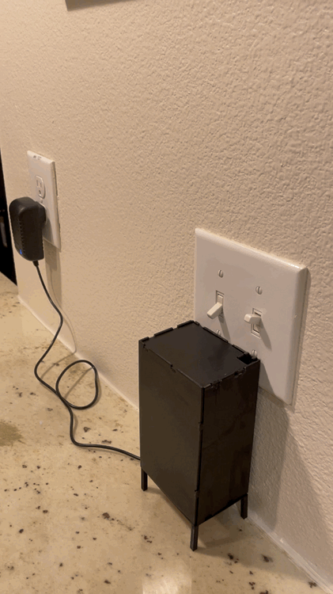

# Alexa Finger
## Description
When traditional "smart" lights are turned off at their physical switch, they become useless to a smart home device like Alexa. The Alexa Finger was created to circumvent this boolean limitation by interacting with lights at their switch level, just as a human would. This makes Alexa's ability to control a light impervious to the previously described scenario. Two things can occur in the event that the Alexa Finger attemps to move a switch to an already active state:

1. If the physical switch is off and Alexa sends an off command, the light will turn on and back off.
2. If the physical switch is on and Alexa sends an on command, the finger will rise up and make no contact with the switch. Then, feeling embarassed by it's failure it will slink back into its housing.

## Design
This project is made up of these three components:

1. A raspberrypi running a simple node red flow that listens for requests from Alexa, and turns them into requests that are passed on to an ESP8266. Communication with Alexa is provided by the node described [here.](https://flows.nodered.org/node/node-red-contrib-amazon-echo)

2. A ESP8266 that translates HTTP requests into servo motor controls, and the necessary power related electronics.

3. A 3D printed rack gear topped with two "finger" grippers that are spaced apart about the width of a standard light switch, a pinion gear, and a very basic housing containing these elements and the electronics above.

#### Note:
The Alexa communication node mentioned above suggests you run node red as root since Alexa sends to port 80, this is not the way. I routed requests received on port 80 to port 8080 by doing:

```bash
$ sudo iptables -I INPUT 1 -p tcp --dport 80 -j ACCEPT
$ sudo iptables -A PREROUTING -t nat -i wlan0 -p tcp --dport 80 -j REDIRECT --to-port 8080
```
And I installed `iptables-persistent` to persist this setting between reboots. More info [here.](https://linuxconfig.org/how-to-make-iptables-rules-persistent-after-reboot-on-linux)

## Examples
The result of saying "Alexa, turn on the finger 1"


The result of saying "Alexa, turn off the finger 1"

